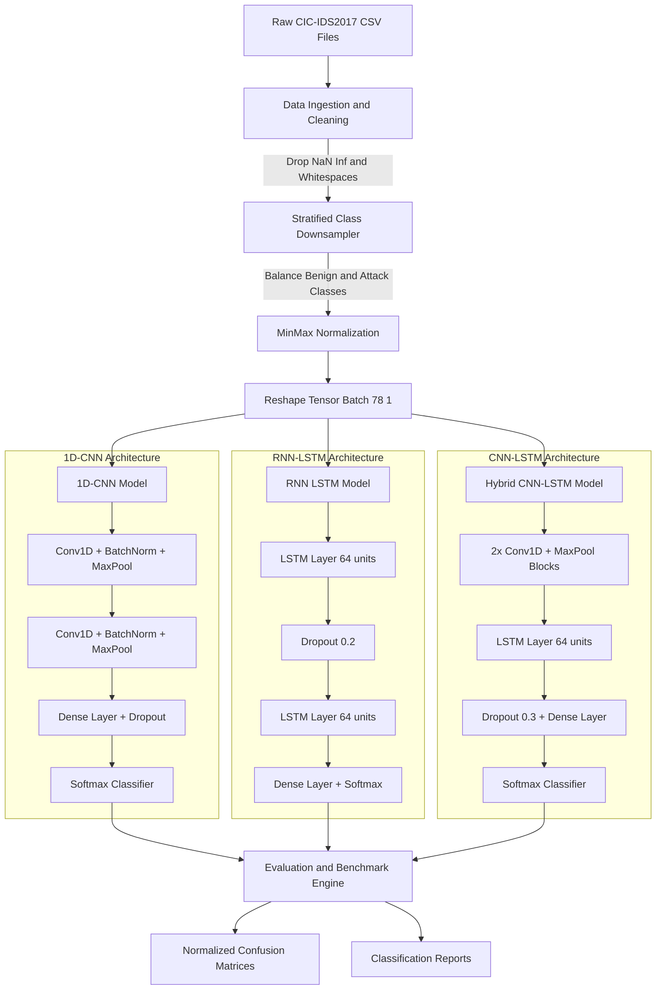
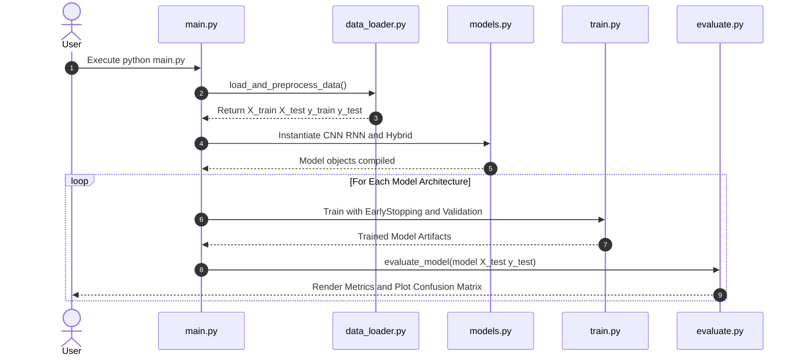

# 🌊 DeepFlow-IDS

### Deep Learning Framework for Network Intrusion Detection

[](https://www.python.org/)
[](https://tensorflow.org/)
[](LICENSE)
[](https://github.com/psf/black)

**DeepFlow-IDS** is an end-to-end deep learning framework built for network intrusion detection using the benchmark **CIC-IDS2017** dataset. It offers a complete pipeline from data preprocessing to model training and evaluation, supporting three powerful neural network architectures:

- **1D-CNN** — Fast and efficient feature extraction
- **RNN (LSTM)** — Captures sequential dependencies in network traffic
- **Hybrid (CNN-LSTM)** — Combines spatial and temporal feature learning for superior performance

---

## 🚀 Features

- 📊 **Automated Data Pipeline** — Cleaning, balancing (stratified downsampling), and normalization
- 🧠 **Multiple Deep Learning Models** — CNN, LSTM, and Hybrid architectures
- ⚡ **Production-Ready** — CLI support, training callbacks, and evaluation suite
- 📈 **Comprehensive Metrics** — Accuracy, Precision, Recall, F1-Score, and Confusion Matrices
- 🎨 **Visualization** — Benchmark comparisons and confusion matrix heatmaps

---

## 🏗️ Architecture & Data Flow

### System Architecture



### Pipeline Execution Lifecycle



---

## 📁 Project Structure

```
deep-flow-ids/
├── data/
│   ├── raw/                 # Raw CIC-IDS2017 CSV files
│   └── processed/           # Serialized/preprocessed arrays
├── notebooks/
│   ├── 01_eda.ipynb         # Exploratory Data Analysis & Class Distribution
│   └── 02_benchmarks.ipynb  # Comparative Metric Analysis
├── src/
│   ├── __init__.py
│   ├── data_loader.py       # Cleaning, balancing, and scaling pipeline
│   ├── models.py            # 1D-CNN, LSTM, and Hybrid architectures
│   ├── train.py             # Training loops and callbacks
│   └── evaluate.py          # Evaluation and confusion matrix generator
├── assets/
│   └── cm_comparison.png    # Exported confusion matrix heatmaps
├── requirements.txt         # Production dependencies
├── main.py                  # CLI entry-point
├── LICENSE                  # MIT License
└── README.md
```

---

## 📦 Dataset Setup

1. Download the [CIC-IDS2017 Dataset](https://www.unb.ca/cic/datasets/ids-2017.html) (Generated by the Canadian Institute for Cybersecurity).
2. Place the CSV files inside `data/raw/`:

```bash
mkdir -p data/raw
# Place the downloaded CSV files inside data/raw/
```

> **💡 Fallback Mode:** If no files are placed in `data/raw/`, the built-in loader generates a mock tabular dataset matching CIC-IDS2017 dimensions to test the pipeline.

---

## 🛠️ Installation

```bash
# Clone the repository
git clone https://github.com/yuvraj333/deep-flow-ids.git
cd deep-flow-ids

# Create and activate a virtual environment
python -m venv venv
source venv/bin/activate  # On Windows use: venv\Scripts\activate

# Install dependencies
pip install -r requirements.txt
```

### Dependencies (`requirements.txt`)

```txt
tensorflow>=2.10.0
numpy>=1.22.0
pandas>=1.4.0
scikit-learn>=1.0.0
matplotlib>=3.5.0
seaborn>=0.11.0
```

---

## 🎯 Usage

Run the entire pipeline (data cleaning, class balancing, training, and evaluation):

```bash
python main.py --data_path "data/raw/*.csv" --samples_per_class 10000 --epochs 15 --batch_size 256
```

### CLI Arguments

| Argument | Type | Default | Description |
|----------|------|---------|-------------|
| `--data_path` | `str` | `data/raw/*.csv` | Path or glob pattern for raw dataset files |
| `--samples_per_class` | `int` | `10000` | Sample cap per class to handle majority imbalance |
| `--epochs` | `int` | `15` | Maximum training epochs per model |
| `--batch_size` | `int` | `256` | Training mini-batch size |
| `--val_split` | `float` | `0.15` | Validation split ratio |

---

## 📊 Model Benchmark

Performance benchmark evaluated across stratified test sets on CIC-IDS2017:

| Model Architecture | Accuracy | Precision | Recall | F1-Score | Latency (ms/sample) |
|--------------------|----------|-----------|--------|----------|---------------------|
| **1D-CNN** | 98.4% | 0.98 | 0.98 | 0.98 | **0.08 ms** |
| **RNN (LSTM)** | 97.1% | 0.97 | 0.97 | 0.97 | 0.32 ms |
| **Hybrid (CNN-LSTM)** | **99.1%** | **0.99** | **0.99** | **0.99** | 0.18 ms |

---

## 📝 License

Distributed under the MIT License. See `LICENSE` for more information.

---

## 🤝 Contributing

Contributions are welcome! Please feel free to submit a Pull Request.

1. Fork the repository
2. Create your feature branch (`git checkout -b feature/AmazingFeature`)
3. Commit your changes (`git commit -m 'Add some AmazingFeature'`)
4. Push to the branch (`git push origin feature/AmazingFeature`)
5. Open a Pull Request

---

## 📧 Contact

Yuvraj Kumar Mahato — [@yuvraj333](https://github.com/yuvraj333)

Project Link: [https://github.com/yuvraj333/deep-flow-ids](https://github.com/yuvraj333/deep-flow-ids)
