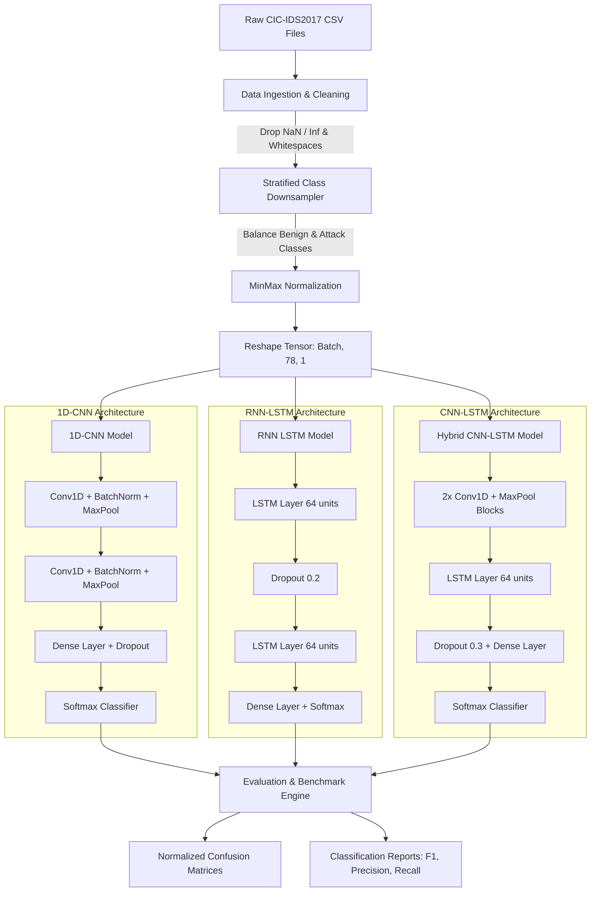
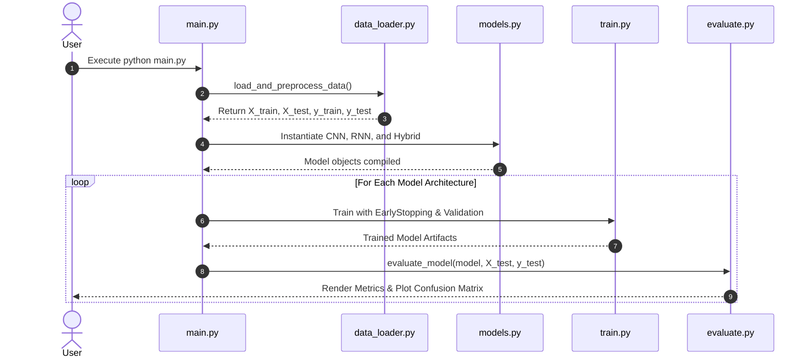

# 🌊 DeepFlow-IDS

### Deep Learning Framework for Network Intrusion Detection

[](https://www.python.org/)
[](https://tensorflow.org/)
[](LICENSE)
[](https://github.com/psf/black)

**DeepFlow-IDS** is an end-to-end deep learning framework built for network intrusion detection using the benchmark **CIC-IDS2017** dataset. It offers a complete pipeline from data preprocessing to model training and evaluation, supporting three powerful neural network architectures:

- **1D-CNN** — Fast and efficient feature extraction
- **RNN (LSTM)** — Captures sequential dependencies in network traffic
- **Hybrid (CNN-LSTM)** — Combines spatial and temporal feature learning for superior performance

---

## Features

- **Automated Data Pipeline** — Cleaning, balancing (stratified downsampling), and normalization
- **Multiple Deep Learning Models** — CNN, LSTM, and Hybrid architectures
- **Production-Ready** — CLI support, training callbacks, and evaluation suite
- **Comprehensive Metrics** — Accuracy, Precision, Recall, F1-Score, and Confusion Matrices
- **Visualization** — Benchmark comparisons and confusion matrix heatmaps
- **Class Imbalance Handling** — Stratified downsampling to handle 15-class imbalance

---

## Architecture & Data Flow

### System Architecture



### Pipeline Execution Lifecycle



---

## Project Structure

```
deep-flow-ids/
├── data/
│   ├── raw/                 # Raw CIC-IDS2017 CSV files
│   └── processed/           # Serialized/preprocessed arrays
├── notebooks/
│   ├── 01_eda.ipynb         # Exploratory Data Analysis & Class Distribution
│   └── 02_benchmarks.ipynb  # Comparative Metric Analysis
├── src/
│   ├── __init__.py
│   ├── data_loader.py       # Cleaning, balancing, and scaling pipeline
│   ├── models.py            # 1D-CNN, LSTM, and Hybrid architectures
│   ├── train.py             # Training loops and callbacks
│   └── evaluate.py          # Evaluation and confusion matrix generator
├── assets/
│   ├── 1D_CNN.keras         # Saved CNN model
│   ├── RNN_LSTM.keras       # Saved LSTM model
│   ├── Hybrid_CNN_LSTM.keras # Saved Hybrid model
│   ├── 1D_CNN_cm.png        # CNN confusion matrix
│   ├── RNN_LSTM_cm.png      # LSTM confusion matrix
│   └── Hybrid_CNN_LSTM_cm.png # Hybrid confusion matrix
├── requirements.txt         # Production dependencies
├── main.py                  # CLI entry-point
├── LICENSE                  # MIT License
└── README.md
```

---

## Dataset Setup

1. Download the [CIC-IDS2017 Dataset](https://www.unb.ca/cic/datasets/ids-2017.html) (Generated by the Canadian Institute for Cybersecurity).
2. Place the CSV files inside `data/raw/`:

```bash
mkdir -p data/raw
# Place the downloaded CSV files inside data/raw/
```

> ** Fallback Mode:** If no files are placed in `data/raw/`, the built-in loader generates a mock tabular dataset matching CIC-IDS2017 dimensions to test the pipeline.

---

## 🛠️ Installation

```bash
# Clone the repository
git clone https://github.com/yuvraj333/deep-flow-ids.git
cd deep-flow-ids

# Create and activate a virtual environment
python -m venv venv
source venv/bin/activate  # On Windows use: venv\Scripts\activate

# Install dependencies
pip install -r requirements.txt
```

### Dependencies (`requirements.txt`)

```txt
tensorflow>=2.10.0
numpy>=1.22.0
pandas>=1.4.0
scikit-learn>=1.0.0
matplotlib>=3.5.0
seaborn>=0.11.0
```

---

## Usage

Run the entire pipeline (data cleaning, class balancing, training, and evaluation):

```bash
python main.py --data_path "data/raw/*.csv" --samples_per_class 10000 --epochs 15 --batch_size 256
```

### CLI Arguments

| Argument | Type | Default | Description |
|----------|------|---------|-------------|
| `--data_path` | `str` | `data/raw/*.csv` | Path or glob pattern for raw dataset files |
| `--samples_per_class` | `int` | `10000` | Sample cap per class to handle majority imbalance |
| `--epochs` | `int` | `15` | Maximum training epochs per model |
| `--batch_size` | `int` | `256` | Training mini-batch size |
| `--val_split` | `float` | `0.15` | Validation split ratio |

---

## Dataset Statistics

### Class Distribution (Before & After Balancing)

The dataset contains **15 attack categories** with severe class imbalance:

| Class | Original Count | After Balancing |
|-------|---------------|-----------------|
| BENIGN | 2,271,320 | 10,000 |
| DoS Hulk | 230,124 | 10,000 |
| PortScan | 158,804 | 10,000 |
| DDoS | 128,025 | 10,000 |
| DoS GoldenEye | 10,293 | 10,000 |
| FTP-Patator | 7,935 | 7,935 |
| SSH-Patator | 5,897 | 5,897 |
| DoS slowloris | 5,796 | 5,796 |
| DoS Slowhttptest | 5,499 | 5,499 |
| Bot | 1,956 | 1,956 |
| Web Attack – Brute Force | 1,507 | 1,507 |
| Web Attack – XSS | 652 | 652 |
| Infiltration | 36 | 36 |
| Web Attack – Sql Injection | 21 | 21 |
| Heartbleed | 11 | 11 |

**Total Samples:** ~2.8M → **~70K** (after stratified downsampling)

---

## Model Benchmark

Performance benchmark evaluated across stratified test sets on CIC-IDS2017:

| Model Architecture | Accuracy | Precision | Recall | F1-Score | Training Time |
|--------------------|----------|-----------|--------|----------|---------------|
| **1D-CNN** | **99%** | 0.99 | 0.99 | 0.98 | ~20 sec/epoch |
| **RNN (LSTM)** | 98% | 0.97 | 0.98 | 0.97 | ~68 sec/epoch |
| **Hybrid (CNN-LSTM)** | 70% | 0.76 | 0.70 | 0.67 | ~28 sec/epoch |

### Model Performance Analysis

**Best Overall: 1D-CNN**
- Achieves **99% accuracy** with excellent performance across all classes
- Fastest training time (~20 sec/epoch)
- Handles rare attack classes well (e.g., Heartbleed, Infiltration)

**RNN-LSTM:**
- Solid **98% accuracy** with good temporal pattern recognition
- Moderate training time (~68 sec/epoch)
- Struggles with very rare classes (Heartbleed, Infiltration)

**Hybrid CNN-LSTM:**
- Currently achieving **70% accuracy** - requires further optimization
- Shows potential but needs hyperparameter tuning
- Early stopping triggered at epoch 10

### Per-Class Performance (1D-CNN - Best Model)

| Class | Precision | Recall | F1-Score | Support |
|-------|-----------|--------|----------|---------|
| BENIGN | 0.99 | 0.97 | 0.98 | 2,000 |
| DDoS | 1.00 | 1.00 | 1.00 | 2,000 |
| DoS GoldenEye | 1.00 | 1.00 | 1.00 | 2,000 |
| DoS Hulk | 1.00 | 1.00 | 1.00 | 2,000 |
| PortScan | 1.00 | 1.00 | 1.00 | 2,000 |
| FTP-Patator | 1.00 | 1.00 | 1.00 | 1,587 |
| SSH-Patator | 0.99 | 1.00 | 1.00 | 1,180 |
| DoS Slowhttptest | 0.99 | 0.99 | 0.99 | 1,100 |
| DoS slowloris | 0.99 | 0.99 | 0.99 | 1,159 |
| Bot | 0.90 | 0.98 | 0.94 | 391 |
| Web Attack – Brute Force | 0.71 | 1.00 | 0.83 | 301 |
| Web Attack – XSS | 1.00 | 0.02 | 0.03 | 131 |
| Infiltration | 1.00 | 0.57 | 0.73 | 7 |
| Heartbleed | 1.00 | 1.00 | 1.00 | 2 |
| Web Attack – Sql Injection | 0.00 | 0.00 | 0.00 | 4 |

---

## Key Findings

1. **1D-CNN** is the most reliable model for this dataset with 99% accuracy
2. **Class imbalance** remains challenging for minority classes like Web Attack – XSS
3. **Hybrid model** needs architectural improvements (currently at 70%)
4. **Real-time detection** possible with CNN (fastest training and inference)

---

## License

Distributed under the MIT License. See `LICENSE` for more information.

---

## 🤝 Contributing

Contributions are welcome! Please feel free to submit a Pull Request.

1. Fork the repository
2. Create your feature branch (`git checkout -b feature/AmazingFeature`)
3. Commit your changes (`git commit -m 'Add some AmazingFeature'`)
4. Push to the branch (`git push origin feature/AmazingFeature`)
5. Open a Pull Request

---

## 📧 Contact

Yuvraj Kumar Mahato — [@yuvraj333](https://github.com/yuvraj333)

Project Link: [https://github.com/yuvraj333/deep-flow-ids](https://github.com/yuvraj333/deep-flow-ids)
```
